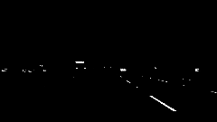
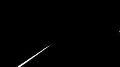
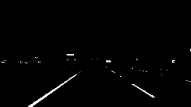
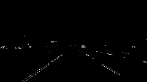
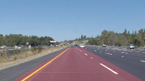

# **Finding Lane Lines on the Road** 

## Theory

Finding lane lines is essential for self-driving cars to be able to localize and operate. To achieve this the goal of this project is to implement a pipeline for recognize and annotate lane lines on a series of images and videos taken from the car dashboard camera.

The way to achieve this is to use certain image processing techniques descibes below. 

## Pipeline

The sections below all describe the pipeline on the following image


### Color Thresholding

To make extracting lines easier we threshold any color other than white and yellow. Basically what we do is we throw away some information that is irrelevant to the job of lane finding.

To threshold white color, we convert the image to grayscale and keep color pixels between 200 and 255. This will give us a mask only containing white pixels

```
image_gray = cv2.cvtColor(image, cv2.COLOR_BGR2GRAY)
mask_white = cv2.inRange(image_gray, 200, 255)
```

Thresholding yellow color is a bit trickier. To make it easier to select a range of yellow color, we convert image to HSV format. This code converts RGB yellow to it's equivalant HSV value

```
RGB color to HSV in OpenCV
yellow_rgb = np.array([[[255, 255, 0]]], dtype="uint8")
yellow_hsv = cv2.cvtColor(yellow_rgb, cv2.COLOR_BGR2HSV)[0,0,:]

lower_yellow = np.array([yellow_hsv[0]-10, 100, 100], dtype="uint8")
upper_yellow = np.array([yellow_hsv[0]+10, 255, 255], dtype="uint8")
```

The following code merges two mask using bitwise or

```
mask = cv2.bitwise_or(mask_yellow, mask_white)
```

White mask     |  Yellow mask    |  Final mask
:-------------:|:---------------:|:--------------:
|  |  |  |

### Region of Interest

We find region of interest by tweeking the values. The region of interest is important because it only limits the next operations to a region of the image that matters to finding lanes

### Finding edges

To find edges we use Canny edge detection algorithm. But before that we apply a Gaussian blur filter to remove noise from the image

```
cv2.Canny(image_blur, low_threshold, high_threshold)
```

After applying canny edge detection and applying region of interest to it we end up with the following images

Edges     | Region of interest | Region of Interest
:-------------:|:---------------:|:--------------:
|  |  |  |

### Finding Lines

After finding edges, we use **Probabilistic Hough Transform** algorithm to find lines. Hough transform requires parameters such as 

Each image requires differernt set of parameters. We need to search for these values by trial and error.

Hough transform returns many lines that some of them are very small. We need to change the *draw_lines* function to avg/extrapolate these lines into one continuous line on each side. To do this, first we have to distinguish left and right line by find line slope. Lines with negative slope belong to the left side and line with positive slope belong to the right.

Once we find left and right lines, I took all points belong to those line and used *numpy.polyfit* function to fit the best line that passes through all of those points. Next I clipped the line to the region of interest and draw the lines on the image.

Finding lines on the video is a bit trickier. Since the lines returned from Hough transform can be noisy from frame to frame, I needed a way to stabilize the lines drawn on the frames. During the processing, I keep the lines in a cache and compute average of the lines drawn on the last 30 frames. This way the sudden changes in a line for a given frame is smoothed by the values of other frames.

## Challenge

To work on the challenge video I resize the region of interest and hough transform parameters to achieve better result.

## Shortcomings

The current pipeline requires manual intervention and parameter tweakings for each image. Also the region of interest has to be defined in advance for each image. Also if hough transform find small line that are not inline with majority of the lines, the fitted line can be off. To fix this I had to tweek hough transform parameters.

## Possible Improvements

It would be nice if we could define a pipeline that automaically finds the best parameters.
